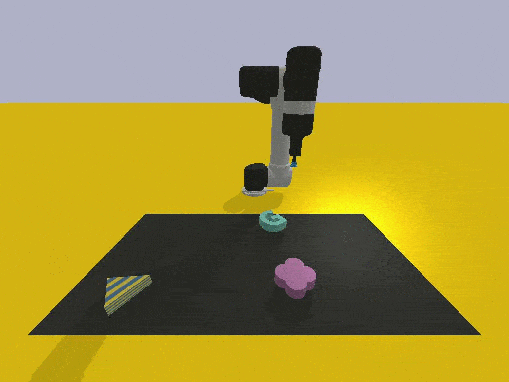

# Text to Action: Mapping Multi-modality Instructions to Robotic Actions with LLMs 

> [**Instruct2Act: Mapping Multi-modality Instructions to Robotic Actions with
Large Language Model**](https://arxiv.org/pdf/2305.11176.pdf)
> Siyuan Huang, Zhengkai Jiang, Hao Dong, Yu Qiao, Peng Gao, Hongsheng Li

- [Instruct2Act: Mapping Multi-modality Instructions to Robotic Actions with Large Language Model](#instruct2act-mapping-multi-modality-instructions-to-robotic-actions-with-large-language-model)
  - [Supported Modules](#supported-modules)
  - [How to run](#how-to-run)
  - [Prompts Setting](#prompts-setting)
  - [Evaluation Tasks](#evaluation-tasks)
  - [Notes](#notes)
  - [Acknowledgement](#acknowledgement)
 

## Supported Modules

Currently, we support the following modules:

Correspondingly, please prepare the SAM and CLIP model ckpts in advance. You can download the ckpts from [SAM](https://github.com/facebookresearch/segment-anything#model-checkpoints) and [OpenCLIP](https://github.com/mlfoundations/open_clip). Then set the path in the file 'engine_robotic.py'.

You can also add your personlized modules in 'engine_robotic.py', and add the API definition in the prompt files.

## How to run

1. Install the required packages with the provided *environment.yaml*
    - If you meet any install issue, you can take a look at [Issue](https://github.com/OpenGVLab/Instruct2Act/issues/6). Thanks for @[euminds](https://github.com/euminds).

2. Install the VIMABench with [VIMABench](https://github.com/vimalabs/VimaBench).

3. Change the OpenAI API-key in *visual_programming_prompt/robotic_exec_generation.py*

4. run the *robotic_anything_gpt_online.py*.

## Prompts Setting

In Instruct2Act, we implement two types of prompts, i.e., **task-specific** and **task-agnostic** prompts. The task-specific prompts are designed for specific tasks which is in the VISPROG style, and the task-agnostic prompts are designed for general purpose, and it is in ViperGPT plus VISPROG style. We provide more details in the our paper. And you can change the setting in the file *visual_programming_prompt/robotic_exec_generation.py*. For very specific tasks like robotic manipulations where you know the flow clearly, we suggest to use the task-specific prompts. For general purpose, we suggest to use the task-agnostic prompts. These two prompts are stored in *visual_programm_prompt.py* and *full_prompt.ini* respectively.

Besides the language prompts, we also provide the pointing-language enhanced prompts where cursor click will be used to select the target objects. You can see the details with funcation *SAM()* in *engine_robotic.py*.  

We provide two code generation mode for robotic manipulation tasks, i.e., **offline** and **online** mode. The codes with offline mode are generated in advance and summarized with expert knowledge, and this type is used for the demo and quick-trail usage. The online mode are generated on the fly, and this type is used for the general purpose.

## Evaluation Tasks

We select six representative meta tasks from VIMABench (17 tasks in total) to evaluate the proposed methods in the tabletop manipulation domain, as shown in below. To run the evaluation, please follow the instructions in the [VIMABench](https://github.com/vimalabs/VimaBench).

| Task | Instruction | Visualization |
|:---:|:---:|:---:|
| Visual Manipulation | Put the  polka dot block  into the  green container. |  |
| Scene Understanding | Put the  blue paisley  object in  another given scene image  into the  green object. |  |
| Rotation | Rotate the  letter-M 30  degrees |  |
| Rearrange | Rearrange to the target scene. |  |
| Rearrange then restore | Rearrange objects to target scene and then restore. |  |
| Pick in order then restore | Put the cyan block into the yellow square then into the white-black square. Finally restore it into its original container. |  |

## Notes

1. To speed up the SAM inference progress, we add **cuda** device option in **function build_sam()**, you should modify it accordingly in the source code and then recompile the package.

2. When using ChatGPT for generation, you need a paid token with API access to GPT 3.5 turbo.

## Acknowledgement

I would like to thank the authors of the following great projects, this project is built upon these great open-sourced projects.
- [Instruct2Act](https://github.com/OpenGVLab/Instruct2Act)
- [VIMABench](https://github.com/vimalabs/VimaBench)
- [OpenCLIP](https://github.com/mlfoundations/open_clip)
- [SAM](https://github.com/facebookresearch/segment-anything#model-checkpoints)
