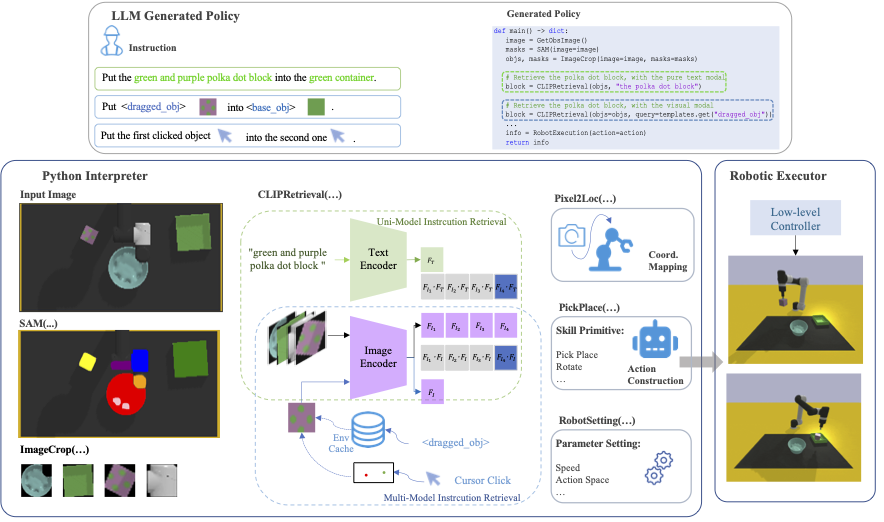
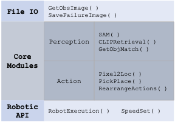
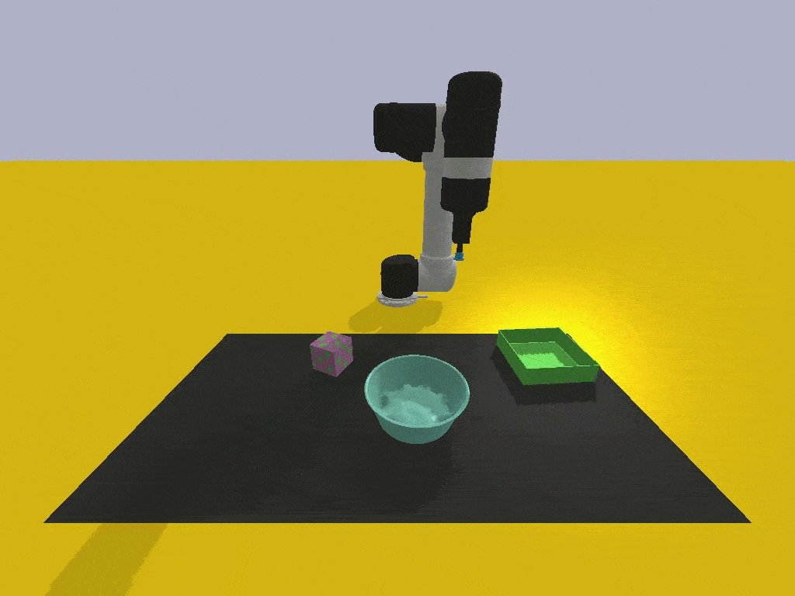
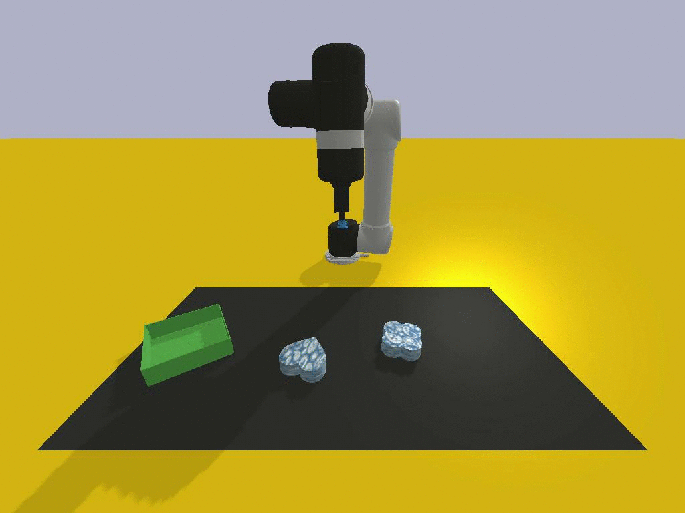

# Text to Action: Mapping text instructions along with Multi-modality data into Robotic Actions using LLMs



> [**Instruct2Act: Mapping Multi-modality Instructions to Robotic Actions with
Large Language Model**](https://arxiv.org/pdf/2305.11176.pdf)
> Siyuan Huang, Zhengkai Jiang, Hao Dong, Yu Qiao, Peng Gao, Hongsheng Li

- [Instruct2Act: Mapping Multi-modality Instructions to Robotic Actions with Large Language Model](#instruct2act-mapping-multi-modality-instructions-to-robotic-actions-with-large-language-model)
  - [Supported Modules](#supported-modules/tasks)
  - [Installation Instructions](#installation-instructions)
  - [How to run](#how-to-run)
  - [Prompts Setting](#prompts-setting)
  - [Evaluation Tasks](#evaluation-tasks)
  - [Notes](#notes)
  - [Acknowledgement](#acknowledgement)
 

## Supported Modules/Tasks

Currently, the following tasks are supported:



Correspondingly, please prepare the SAM and CLIP model ckpts in advance. You can download the ckpts from [SAM](https://github.com/facebookresearch/segment-anything#model-checkpoints) and [OpenCLIP](https://github.com/mlfoundations/open_clip). Then set the path in the file 'engine_robotic.py'.


## Installation Instructions
   These instructions were tested on an Ubuntu os with conda package manager
1. Clone this repository or download and extract the zip file to a folder named 'text-to-action'
   ``` git clone https://github.com/bhanu-pm/text-to-action.git text-to-action ```
2. Install dependencies into a conda environment
   ```
   cd text-to-action
   ```
   ```
   conda env create -f environment.yaml
   ```
4. Install torch
   ```
   conda activate project-10
   ```
   ```
   pip install torch==1.12.1+cu113 torchvision==0.13.1+cu113 torchaudio==0.12.1 --extra-index-url https://download.pytorch.org/whl/cu113
   ```
5. Install requirements from requirements.txt file
   ```
   pip install -r requirements.txt
   ```
6. Install vimabench
   ```
   cd ..
   ```
   ```
   git clone https://github.com/vimalabs/VimaBench VIMABench
   ```
   ```
   cd VIMABench
   ```
   ```
   pip install -e .
   ```
    
7. Install segment-anything model from my fork of the facebook's repository. I made some functionality upgrades to give it the ability to run on nvidia GPU if it is present on the device.
   ```
   cd ..
   ```
   ```
   git clone https://github.com/bhanu-pm/segment-anything.git SAM
   ```
   ```
   cd SAM
   ```
   ```
   pip install -e .
   ```
8. Install Open-clip
   ```
   cd ..
   ```
   ```
   git clone https://github.com/mlfoundations/open_clip.git open-clip
   ```
   ```
   cd open-clip
   ```
   ```
   pip install -e .
   ```
   ```
   cd ..
   ```

## How to Run
1. Get your openai api key from the following link [API key](https://platform.openai.com/api-keys)
2. Paste the api key 
3. Install the VIMABench with [VIMABench](https://github.com/vimalabs/VimaBench).

4. Change the OpenAI API-key in *visual_programming_prompt/robotic_exec_generation.py*

5. run the *robotic_anything_gpt_online.py*.

## Prompts Setting

There are two code generation modes for robotic manipulation tasks, i.e., **offline** and **online** modes. The codes in the offline mode are generated in advance, for demo purpose. The code in online mode is generated on the fly, using OpenAI's API.

## Evaluation Tasks

I selected only 4 representative meta tasks from VIMABench (17 tasks in total) to evaluate the proposed methods in the tabletop manipulation domain, as shown below.

| Task | Instruction | Visualization |
|:---:|:---:|:---:|
| Visual Manipulation | Put the  polka dot block  into the  green container. |  |
| Rotation | Rotate the  letter-M 30  degrees |  |
| Pick in order then restore | Put the cyan block into the yellow square then into the white-black square. Finally restore it into its original container. |  |
| Scene Understanding | Put the  blue paisley  object in  another given scene image  into the  green object. |  |

## Notes

1. To speed up the SAM inference progress, I added a custom **cuda** device option in **build_sam()** function of facebook's segment-anything module.
2. When using ChatGPT for generation, you need a paid token with API access to GPT 3.5 turbo.

## Acknowledgement

I would like to thank the authors of the following great projects, this project is built upon these great open-sourced projects.
- [Instruct2Act](https://github.com/OpenGVLab/Instruct2Act)
- [VIMABench](https://github.com/vimalabs/VimaBench)
- [OpenCLIP](https://github.com/mlfoundations/open_clip)
- [SAM](https://github.com/facebookresearch/segment-anything#model-checkpoints)
